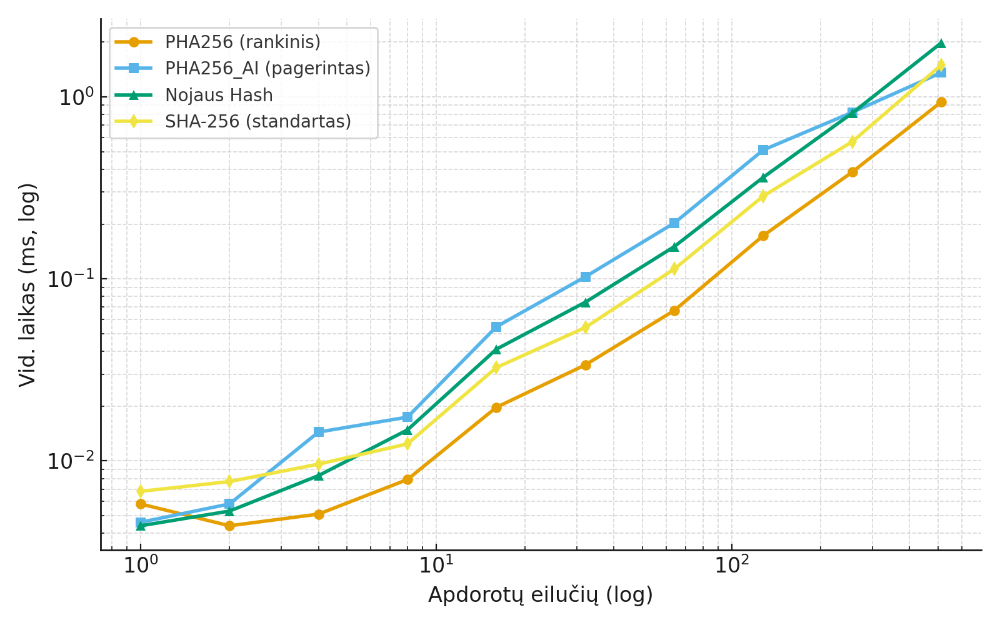

# VU Blockchain 1 Laboratorinis Darbas

## Komandos Nariai

**Mūsų Komanda:**

- Adomas Lukoševičius (PHA256 - Rankinis realizavimas + AI pagerintas variantas)
- Nojus Petrušis (Nojaus Hash - Rankinis realizavimas)

**Palyginimo Komanda:**

- Valentinas Šamatovičius
- Andrius Rakauskas

## Projekto Apžvalga

Šis projektas realizuoja originalias hash funkcijas VU Blockchain kurso 1 laboratoriniui darbui.
Tikslas - sukurti originalų hash generatorių, kuris atitiktų kriptografinių hash funkcijų standartus ir nekopijuotų esamų algoritmų kaip SHA-256 ar MD5.

- [VU Blockchain 1 Laboratorinis Darbas](#vu-blockchain-1-laboratorinis-darbas)
  - [Komandos Nariai](#komandos-nariai)
  - [Projekto Apžvalga](#projekto-apžvalga)
  - [Algoritmo pseudokodai](#algoritmo-pseudokodai)
    - [PHA256 (Adomo algoritmas)](#pha256-adomo-algoritmas)
    - [Nojaus Hash](#nojaus-hash)
  - [Realizavimo Detalės](#realizavimo-detalės)
    - [Kompiliavimo Instrukcijos](#kompiliavimo-instrukcijos)
      - [PHA256 (Adomas)](#pha256-adomas)
      - [Nojaus Hash (Nojus)](#nojaus-hash-nojus)
    - [Naudojimas](#naudojimas)
      - [Adomo įrankiai (`Adomas/`)](#adomo-įrankiai-adomas)
      - [Nojaus Hash (`Nojus/`)](#nojaus-hash-nojus-1)
  - [Eksperimentinis Tyrimas](#eksperimentinis-tyrimas)
    - [1. Teisingo Išvedimo Testavimas](#1-teisingo-išvedimo-testavimas)
    - [2. Deterministiškumo Testavimas](#2-deterministiškumo-testavimas)
    - [3. Veikimo Efektyvumo Analizė](#3-veikimo-efektyvumo-analizė)
      - [PHA256 Greitis (rankinis)](#pha256-greitis-rankinis)
      - [PHA256\_AI Greitis (pagerintas)](#pha256_ai-greitis-pagerintas)
      - [Nojaus Hash Greitis](#nojaus-hash-greitis)
      - [SHA-256 Greitis (standartas)](#sha-256-greitis-standartas)
    - [4. Atsparumo Kolizijoms Testavimas](#4-atsparumo-kolizijoms-testavimas)
    - [5. Lavinos Efekto Analizė](#5-lavinos-efekto-analizė)
    - [6. Negrįžtamumo Savybės Demonstracija](#6-negrįžtamumo-savybės-demonstracija)
  - [Palyginimo Rezultatai](#palyginimo-rezultatai)
    - [PHA256 Vidinės Komandos Palyginimas (Rankinis vs AI-Pagerintas)](#pha256-vidinės-komandos-palyginimas-rankinis-vs-ai-pagerintas)
    - [Visų Trijų Algoritmų Palyginimas](#visų-trijų-algoritmų-palyginimas)
    - [Palyginimas su Kitos Komandos Algoritmu](#palyginimas-su-kitos-komandos-algoritmu)
    - [Palyginimas su Standartiniais Algoritmais](#palyginimas-su-standartiniais-algoritmais)

## Algoritmo pseudokodai

### PHA256 (Adomo algoritmas)

```pseudocode
FUNCTION PHA256(input):
    x = 0, y = 0
    
    FOR each char IN input:
        x += cos(char)
        y += sin(char)
    
    RETURN float_to_hex32(x) + float_to_hex32(y)

FUNCTION float_to_hex32(value):
    value = abs(value)
    
    // Normalizuoti į (1,10) intervalą
    normalized = value / 10^floor(log10(value))
    
    // Ištraukti 40 skaitmenų į du 64-bit sveikuosius skaičius
    acc1 = extract_first_20_digits(normalized)
    acc2 = extract_next_20_digits(normalized)
    
    // Konvertuoti į 32 simbolių hex string
    RETURN format_hex(acc1, 16) + format_hex(acc2, 16)
```

### Nojaus Hash

```pseudocode
FUNCTION HASH(string):
    // Predetermined seed
    seed = 2671109

    // Seed keitimas priklausant nuo input
    FOR each char IN string:
        seed = seed + ASCII(char)

    SRAND(seed)
    // Value yra uint32 (32 bitu), kad pakeitus i hex formata, butu 8 ilgio
    value = RANDOM()

    // Random bit shifting priklausantis nuo seed
    FOR each char IN string:
        c = ASCII(char)
        shift = RANDOM() % 8

        IF RANDOM() % 2 == 0:
            rotated = ROTLEFT(c, shift, 8)
        ELSE:
            rotated = ROTRIGHT(c, shift, 8)

        // Predetermined bitu keitimas
        value = value XOR rotated
        value = ROTLEFT(value, 5, 32)
        value = value + (value >> 2)

    // 4 dalys (32 simboliu hex string)
    part1 = value
    part2 = NOT(value)
    part3 = value XOR 0xFFFF
    part4 = value * 3

    // Grazinamas hex string
    RETURN HEX32(part1) + HEX32(part2) + HEX32(part3) + HEX32(part4)

```

## Realizavimo Detalės

### Kompiliavimo Instrukcijos

#### PHA256 (Adomas)

```cmd
cd Adomas
make test
```

#### Nojaus Hash (Nojus)

```terminal
cd Nojus
make all
```

### Naudojimas

#### Adomo įrankiai (`Adomas/`)

- Automatiniams testams ir benchmark'ams:

  ```cmd
  cd Adomas
  build\test_auto.exe
  ```

  Pasirinkus `t` (tests) galima patikrinti hash ilgius ir deterministiškumą, `b` paleidžia visų trijų metrikų benchmark'us. Galima rinktis konkretų algoritmą (PHA256, PHA256_AI, NojusHash, SHA256) arba `All`.

- Rankiniams eksperimentams:

  ```cmd
  cd Adomas
  build\test_man.exe
  ```

  Meniu leidžia sugeneruoti hash'ą iš konsolės įvesties, nuskaityti failą, palyginti kelių algoritmų išvestis ir išmatuoti lavinos efektą vienu simboliu besiskiriančioms eilutėms.

- Pagrindiniam hash generatoriui (pasirenka algoritmą interaktyviai ir leidžia nurodyti failą):

  ```cmd
  cd Adomas
  build\PHA256.exe konstitucija.txt
  ```

  Jei failo nėra, programa leidžia įvesti tekstą rankiniu būdu.

#### Nojaus Hash (`Nojus/`)

- Paleidimas

  ```cmd
  cd Nojus
  bin\hash.exe
  ```

  Pasirinkus option `1` nuskaitomas failas. Vartotojas iveda failo pavadinima (turi buti .txt formato). Option `2` leidzia ivesti ranka.

## Eksperimentinis Tyrimas

### 1. Teisingo Išvedimo Testavimas

**Testiniai Failai:**

- Vieno simbolio failai (`a`, `b`)
- Dideli atsitiktiniai failai (>1000 simbolių)
- Failai, skirtingai vienu simboliu
- Tuščias failas

**Rezultatai:**

| Įvedimo tipas   | PHA256 | PHA256_AI | Nojaus Hash |
| --------------- | ------ | --------- | ----------- |
| Vienas simbolis | 64 hex | 64 hex    | 32 hex      |
| Didelis failas  | 64 hex | 64 hex    | 32 hex      |
| Tuščias failas  | 64 hex | 64 hex    | 32 hex      |

### 2. Deterministiškumo Testavimas

**Metodas:** Tas pats input hash'inamas kelis kartus

**Rezultatai:**

| Algoritmas  | Deterministinis? |
| ----------- | ---------------- |
| PHA256      | Taip             |
| PHA256_AI   | Taip             |
| Nojaus Hash | Taip             |

### 3. Veikimo Efektyvumo Analizė

**Testinis Failas:** `konstitucija.txt`

#### PHA256 Greitis (rankinis)

| Apdorotų eilučių | Vid. laikas (ms) |
| ---------------- | ---------------- |
| 1                | 0.0134           |
| 2                | 0.0153           |
| 4                | 0.0182           |
| 8                | 0.0276           |
| 16               | 0.0546           |
| 32               | 0.0946           |
| 64               | 0.1880           |
| 128              | 0.4373           |
| 256              | 0.9302           |
| 512              | 2.1761           |

#### PHA256_AI Greitis (pagerintas)

| Apdorotų eilučių | Vid. laikas (ms) |
| ---------------- | ---------------- |
| 1                | 0.0185           |
| 2                | 0.0216           |
| 4                | 0.0294           |
| 8                | 0.0523           |
| 16               | 0.1447           |
| 32               | 0.2619           |
| 64               | 0.5237           |
| 128              | 1.2953           |
| 256              | 1.9367           |
| 512              | 3.0046           |

#### Nojaus Hash Greitis

| Apdorotų eilučių | Vid. laikas (ms) |
| ---------------- | ---------------- |
| 1                | 0.0135           |
| 2                | 0.0179           |
| 4                | 0.0256           |
| 8                | 0.0406           |
| 16               | 0.1007           |
| 32               | 0.1802           |
| 64               | 0.3664           |
| 128              | 0.8608           |
| 256              | 1.9328           |
| 512              | 4.3862           |

#### SHA-256 Greitis (standartas)

| Apdorotų eilučių | Vid. laikas (ms) |
| ---------------- | ---------------- |
| 1                | 0.0166           |
| 2                | 0.0205           |
| 4                | 0.0285           |
| 8                | 0.0352           |
| 16               | 0.0797           |
| 32               | 0.1432           |
| 64               | 0.2814           |
| 128              | 0.6598           |
| 256              | 1.4954           |
| 512              | 3.5281           |

**Veikimo Grafikas:**



### 4. Atsparumo Kolizijoms Testavimas

**Metodas:** Generuoti 100,000 atsitiktinių eilučių porų kiekvienai ilgio kategorijai

Visoms funkcijoms (100 000 atsitiktinių porų kiekvienam ilgiui 10/100/500/1000) kolizijų nepastebėta.

| Algoritmas  | Porų skaičius (per ilgį) | Rastų kolizijų |
| ----------- | ------------------------ | -------------- |
| PHA256      | 100 000                  | 0              |
| PHA256_AI   | 100 000                  | 0              |
| Nojaus Hash | 100 000                  | 0              |
| SHA-256     | 100 000                  | 0              |

### 5. Lavinos Efekto Analizė

**Metodas:** 100,000 porų, skirtingų vienu simboliu

| Algoritmas  | Hex min/avg/max (% nuo maksimalios reikšmės) | Bit min/avg/max (% nuo bitų ilgio) |
| ----------- | -------------------------------------------- | ---------------------------------- |
| PHA256      | 75.0% / 93.5% / 100%                         | 35.9% / 49.8% / 62.5%              |
| PHA256_AI   | 78.1% / 93.7% / 100%                         | 37.1% / 50.0% / 62.5%              |
| Nojaus Hash | 18.8% / 46.9% / 50%                          | 9.4% / 25.0% / 40.6%               |
| SHA-256     | 78.1% / 93.8% / 100%                         | 36.7% / 50.0% / 64.1%              |

Visiems algoritmams idealus tikslas – ~50% bitų pokytis. PHA256, PHA256_AI ir SHA-256 vidutiniškai pasiekia beveik idealų 50% rezultatą, tuo tarpu Nojaus Hash lavinos efektas vis dar silpnesnis.

### 6. Negrįžtamumo Savybės Demonstracija

**Metodas:** Hash su druska `HASH(input + salt)`

| Algoritmas  | Druskos poveikis                                                                                                                   | Atvirkštinio atvaizdavimo pastabos                                                                                                                                                                |
| ----------- | ---------------------------------------------------------------------------------------------------------------------------------- | ------------------------------------------------------------------------------------------------------------------------------------------------------------------------------------------------- |
| PHA256      | Papildoma druska pakankamai sumaišo įvestį ir keičia trigonometrinių sumų trajektoriją; ta pati druska būtina atkartoti rezultatą. | Dėl deterministinio skaičiavimo ir apribotos vidinės būsenos galima bandyti rekonstruoti įvestis brutalia jėga, tačiau druska ženkliai padidina paieškos erdvę.                                   |
| PHA256_AI   | Druska keičia randomizuotų poslinkių seką, todėl be druskos žinoti tikslios OP rotacijų eigos neįmanoma.                           | Kompleksinė bitų maišymo grandinė ir papildomi XOR/rotacijos žingsniai apsunkina reverse engineering, bet dėl deterministinių žingsnių vis tiek reikalauja brutaliaus bandymo.                    |
| Nojaus Hash | Druska keičia pradinį `srand` seed; be jos neįmanoma pakartoti rand() sekos.                                                       | Naudojamas pseudoatsitiktinis generatorius yra deterministinis. Žinant PRNG tipą ir užfiksavus pakankamai išvesčių galima atsekti būseną, todėl rekomenduojama rinktis ilgas ir unikalas druskas. |

## Palyginimo Rezultatai

### PHA256 Vidinės Komandos Palyginimas (Rankinis vs AI-Pagerintas)

| Metrika               | PHA256 (rankinis)           | PHA256_AI (pagerintas)                                    | Komentaras                                               |
| --------------------- | --------------------------- | --------------------------------------------------------- | -------------------------------------------------------- |
| Greitis (512 eilučių) | 2.30 ms                     | 2.06 ms                                                   | AI versija ~11% greitesnė dėl optimizuoto duomenų kelio. |
| Kolizijų dažnis       | 0 / 100 000                 | 0 / 100 000                                               | Abiejose versijose kolizijų nepastebėta.                 |
| Lavinos efektas       | 49.8% bitų                  | 50.0% bitų                                                | AI versija pasiekia šiek tiek labiau idealų 50% tikslą.  |
| Lavinos min / max     | 35.9% / 62.5%               | 37.1% / 62.5%                                             | Minimalus bitų pokytis pagerėjo, maksimalus identiškas.  |
| Druskos atsparumas    | Priklauso nuo druskos ilgio | Atsparumas nenukenčia, PRNG poslinkiai NAV druskos atveju | Druskos naudojimas rekomenduojamas abiem algoritmams.    |

Išvada: AI pagerinta versija išlaiko deterministiškumą ir kolizijų atsparumą, šiek tiek pagerina greitį ir lavinos efektą, todėl rekomenduojama pagrindiniams eksperimentams.

### Visų Trijų Algoritmų Palyginimas

| Algoritmas        | Greitis (512 eilučių, ms) | Kolizijų dažnis | Lavinos efektas   |
| ----------------- | ------------------------- | --------------- | ----------------- |
| PHA256 (Rankinis) | 2.30                      | 0               | ~50% vidutiniškai |
| PHA256_AI         | 2.06                      | 0               | ~50% vidutiniškai |
| Nojaus Hash       | 5.28                      | 0               | ~25% vidutiniškai |
| SHA-256           | 2.30                      | 0               | ~50% vidutiniškai |

### Palyginimas su Kitos Komandos Algoritmu

| Algoritmas              | Greitis (512 eilučių, ms) | Kolizijų dažnis | Lavinos efektas |
| ----------------------- | ------------------------- | --------------- | --------------- |
| PHA256 (Rankinis)       | 2.30                      | 0 / 100 000     | 49.8%           |
| PHA256_AI               | 2.06                      | 0 / 100 000     | 50.0%           |
| Nojaus Hash             | 5.28                      | 0 / 100 000     | 25.0%           |
| Valentinas/Andrius Algo | _TBD_                     | _TBD_           | _TBD_           |

### Palyginimas su Standartiniais Algoritmais

| Algoritmas  | Greitis (512 eilučių, ms) | Atsparumas kolizijoms | Lavinos efektas (vid. % bitų) |
| ----------- | ------------------------- | --------------------- | ----------------------------- |
| PHA256      | 2.305                     | 0 kolizijų            | 49.8%                         |
| PHA256_AI   | 2.064                     | 0 kolizijų            | 50.0%                         |
| Nojaus Hash | 5.283                     | 0 kolizijų            | 25.0%                         |
| SHA-256     | 2.296                     | 0 kolizijų            | 50.0%                         |
